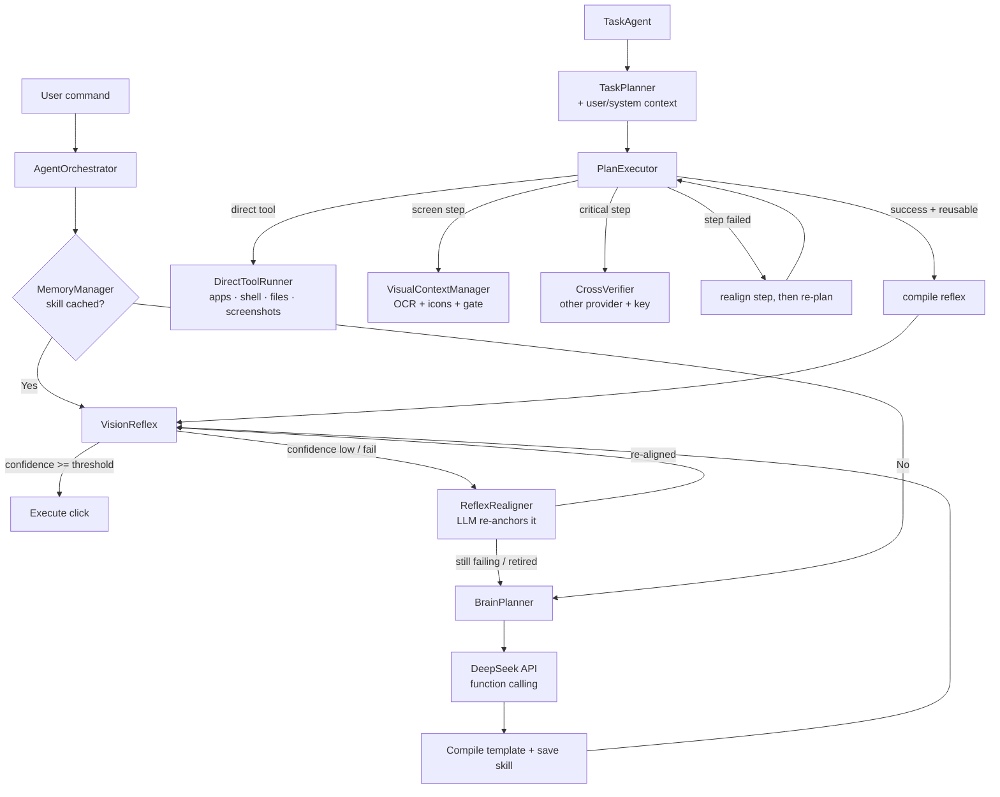

# Furti AI

Desktop automation agent that removes the latency and token-cost bottlenecks of
standard vision-language-action (VLA) agents by **compiling LLM plans into
local reflexes**.

Instead of calling the model on every frame, Furti AI calls it exactly once per
novel task. The resulting plan is "compiled" into a cropped template image +
metadata, cached locally, and replayed by OpenCV in milliseconds.

## Architecture



| Module | Responsibility |
| --- | --- |
| `AgentOrchestrator` | Main loop; routes Memory -> VisionReflex, owns the fallback |
| `MemoryManager` | RAG/cache layer; stores template paths + metadata as JSON |
| `VisionReflex` | OpenCV template matching + input execution, strict threshold |
| `ReflexRealigner` | Re-anchors a stale reflex with the LLM and rewrites its template |
| `BrainPlanner` | DeepSeek fallback; compiles plans into new reflexes |
| `TaskPlanner` / `PlanExecutor` | Multi-step planning, re-alignment, verification and execution |
| `DirectToolRunner` | OS-level tools (apps, shell, files, screenshots, windows) |
| `UserContext` | The user/system context file injected into every prompt |
| `CrossVerifier` | Independent second opinion on the other provider |
| `ScreenCapture` / `InputController` | Swappable capture and mouse/keyboard backends |
| `Settings` | Paths, thresholds, and model endpoint |

## Install

```powershell
python -m venv .venv
.venv\Scripts\Activate.ps1
pip install -r requirements.txt
```

## Run the offline demo

The demo uses a synthetic screen and a mock LLM, so it performs **zero real
clicks** and needs **no API key**:

```powershell
python -m furti_ai
```

It walks through three phases:

1. **Novel task** — no cached skill, so the planner compiles a reflex.
2. **Cached task** — the reflex replays with zero LLM calls.
3. **UI changed** — the cached reflex fails, triggering the planner fallback
   and a successful retry.

## Real usage

```powershell
$env:DEEPSEEK_API_KEY = "sk-..."
```

```python
from furti_ai import build_agent

agent = build_agent()
agent.run("Click the Export button")
```

> **Vision note:** the task pipeline defaults to the OpenAI-compatible
> `deepseek-flash` model when DeepSeek is selected. It sends screenshots using
> the `image_url` chat payload when the visual gate decides that pixels are
> needed. You can point `DEEPSEEK_BASE_URL` / `DEEPSEEK_MODEL` at another
> vision-capable endpoint if required.

## Graphical application (recommended)

The root [`app.py`](app.py) now opens the complete Tkinter application when
started without a task:

```powershell
$env:DEEPSEEK_API_KEY = "..."
python app.py
```

The window provides:

- a natural-language task editor and task/reflex mode selector,
- an always-visible **Progress** bar with a live caption: it shows
  "Step 2 of 5 (40%)" while the run works through the plan, advances within a
  step (locating the target → acting → verifying), and animates as an
  indeterminate bar while the task is still being planned, so the window always
  shows that something is happening,
- a **Settings** toggle: the settings form is collapsed by default and appears
  when you tick it (it also opens itself if a value needs fixing). Everything
  inside it is the same topic-tabbed form, grouped into **Models / Input /
  Safety / Vision / Advanced / AI Context / Reflexes** tabs,
- masked provider/API-key fields and a control for every
  [`Settings`](furti_ai/config.py) option,
- a **Reflexes** tab listing every compiled reflex with per-reflex on/off
  switches (new reflexes are stored disabled), hit/miss counters, bulk
  enable/disable and delete controls,
- a live plan preview with **Approve and run**, **Edit and re-plan**, and
  **Decline** controls,
- live phase, current step, screenshot age, current action, AI response,
  token/cost estimate, and report-path indicators (the always-on-top status
  window mirrors the same progress bar for when the main window is behind
  something else),
- a scrollable event log that mirrors the timestamped console transparency,
- a Stop button that shares the global `<ctrl>+<alt>+k` abort event.

The planner and executor run in a worker thread, so the window remains
responsive while the model is thinking or waiting for a response. No mouse or
keyboard action is dispatched until the plan is approved in the window. The
planner can also emit an `ask_user` step when it cannot safely choose between
options; Furti opens a choice dialog, adds the answer to the next planning
request, and only then shows the revised plan for approval.
The main application window replaces the smaller always-on-top status overlay for
this mode.

Command-line execution remains available for scripts and unattended wrappers:

```powershell
python app.py --task "Open Notepad, write 'hello', and save the file"
```

## Multi-step task pipeline

The `TaskAgent` pipeline plans a whole instruction into **ordered steps**
(escalating to a smarter model when needed), shows the plan, and waits for
explicit confirmation before executing anything. The GUI uses its plan
buttons; the command-line wrapper uses console confirmation:

```powershell
$env:DEEPSEEK_API_KEY = "..."        # auto selects DeepSeek-flash when available
# Or force the image-capable DeepSeek path:
$env:FURTI_LLM_PROVIDER = "deepseek"
$env:DEEPSEEK_MODEL = "deepseek-flash"
# Or use Gemini explicitly:
# $env:FURTI_LLM_PROVIDER = "gemini"
pip install -r requirements-ocr.txt  # optional: fast RapidOCR text grounding
# (when RapidOCR is absent, Furti falls back to an installed PaddleOCR
#  automatically so text grounding stays on)

python app.py --task "Open Notepad, write 'hello', and save the file"
```

While running:

- every **thought / step / action** is printed as
  `[HH:MM:SS] [KIND] message` and mirrored on the full application window
  (or the smaller always-on-top Tk status window for the command-line
  wrapper) (task, phase, step, last log lines, token count),
- the GUI also opens that **separate always-on-top status window** while a task
  runs (built as a `Toplevel` of the application, so both windows coexist). It
  mirrors the task, phase, current step, the current action, the latest raw AI
  response, the last screenshot age, token/cost usage and its own **STOP TASK**
  button. It lingers for a moment after the task ends and then hides, without
  creating a new window on the next run; uncheck **Always-on-top status window**
  in the *Live status* panel (or set `FURTI_STATUS_WINDOW=false`) to turn
  it off,
- each input action immediately emits a `CONFIRM` event after the controller
  returns successfully; the default post-step review then uses one model call
  to verify the completed step, decide whether text or visual evidence was
  needed, and check whether the next step is ready,
- the application/status window shows the last screenshot timestamp and age,
  the latest raw AI response, and a highlighted current-action signal
  (`SEARCHING`, `ACTING`, `CONFIRMED`, `WAITING FOR AI`, or `ERROR`),
- if a step cannot be completed, the agent first retries/re-anchors it and
  then asks the model for a different route for the unfinished steps; it
  never repeats an unchanged failed route indefinitely,
- `THOUGHT`, `WAIT`, and response events show whether the AI is reasoning or
  waiting on a model response; there is no fixed sleep between successful
  steps,
- the cursor **moves smoothly** to targets by default
  (`FURTI_CURSOR_TELEPORT=true` restores instant jumps) and every button press
  waits out a short `FURTI_CLICK_SETTLE` pause after the cursor arrives, so a
  click is not delivered while the target window is still processing the move,
- **a cursor parked in a screen corner no longer freezes the mouse**: that
  position is pyautogui's abort corner and raises `FailSafeException` on every
  later input call, which used to stop all movement once a schema placeholder
  (`"x": 0, "y": 0`) was echoed into a plan. Such a park is now nudged back
  inward and automation continues, while gestures that deliberately target a
  corner (the Start button) still work. Set `FURTI_FAILSAFE=false` to drop the
  corner abort entirely and rely on the kill hotkey,
- the model is asked for **JSON-only output** (`response_format` /
  `response_mime_type`; endpoints that reject the hint are retried without it)
  and every control payload is read by one strict reader: NaN, truncated
  objects, bare arrays and prose are refused instead of guessed at,
- **a control payload is validated before it can move anything**: an unknown
  action name, a negative, non-numeric or absurd coordinate, a negative bbox
  size, or a `type` step with no text fails the step and makes the planner
  re-ask (escalating to the smarter model) — an unmapped action is never
  silently executed as a click,
- **an off-screen point is refused**: a resolved grab or drop point outside the
  virtual desktop fails the step with the reason recorded, instead of throwing
  the cursor off-screen where every later click would land somewhere
  unintended (multi-monitor negative coordinates still work),
- **keyboard shortcuts really fire**: `key_press` accepts a chord
  (`ctrl+shift+t`, `alt+tab`, `win+r`, `page down`) which `keyboard.py`
  normalizes onto pyautogui's key names and dispatches with `hotkey()`, so the
  modifier and key are held down together. `pyautogui.press("ctrl+c")` is a
  silent no-op (the name is not in `KEYBOARD_KEYS`), so plain `press()` is only
  used for single keys; an unknown key name raises instead of pressing nothing,
- **drags** are a first-class action: `{"action": "drag"}` with a grab target
  (`target`/`bbox`, `params.from_x`/`from_y`, or the current cursor) and a drop
  hint (`to_target`, `to_bbox`, `to_x`/`to_y`, or `dx`/`dy`), plus an optional
  `button` and `hold_keys` for shift-drag/right-drag gestures. The mouse button
  is released in a `finally` block, and a named drop target that cannot be found
  fails the step instead of dropping at a stale point. A drag never clicks:
  when a press is needed at the drop position the plan asks for a separate
  `click` step,
- **explicit coordinates are honoured**: `action=move` puts the cursor on the
  step's `x`/`y` without clicking, and `click`/`double_click`/`right_click`
  press there, so an element with no readable text or saved icon template no
  longer degrades into "no target anchor found". `params.clicks` repeats a
  press, and model spellings such as `mouse_move`, `click_at`, `hover` or
  `send_keys` are normalized onto the real actions instead of falling back to a
  click,
- **typing lands in the field the step names**: a `type` step whose target
  resolved on the live screen — an `icon:name`, an OCR label, or explicit
  `x`/`y` pixels — is clicked once first, so the input box gains focus and the
  caret is placed where the text should appear. The click is also emitted as its
  own plan step, which makes the required sequence **click → verify focus →
  type** visible in the preview and gives it its own post-step review. The same
  field is never pressed twice (`params.focus_click=false` opts out entirely),
  and a `type` step with no target types into whichever control already has
  focus — which is why "type at the search box" no longer dumps the text into
  the window that happened to be focused,
- **the right one of several identical controls is picked**: a label is not an
  identity, so when two fields share a label or placeholder (two "Search"
  boxes, a "Name" field in a page and in a dialog) or several buttons look the
  same, the agent prefers the control nearest the point the step named — the
  centre of its `bbox`, or its explicit `x`/`y`. Closeness only ever breaks a
  tie between equally good matches, so an exact label still beats a vague
  description that happens to sit nearer. The same rule is applied when a
  planned crop of an empty input box is re-found on the live screen (an empty
  box is near-uniform, and template matching used to peak on any identical
  box). When the plan names no point and several controls tie, the log says so
  — "nearest of N matches" — instead of choosing silently,
- **a popup never gets read as content**: before acting, the agent asks which
  window owns the target pixel. If a dialog, cookie banner or modal is sitting
  on it — or the target text is missing while the screen offers a `Close`/`X`
  affordance — dismissing it becomes the priority: the close label is clicked
  (or `ESC` pressed) and the step is retried against the real target. A
  dialog-sized window is treated as a modal; a full-size other window is
  handled by refocusing the intended one instead, because `ESC` there would do
  something unrelated. Furti's own always-on-top readout is recognised too, and
  reported in the log when it covers the target,
- **actions are paced, not chained blindly**: after a click, drag, keystroke or
  tool call that can change the screen, the next interaction waits out
  `FURTI_RENDER_DELAY` (0.35 s — the 200–500 ms a UI needs to render) and the
  post-step review first answers "is the next step ready?", so a click that
  navigates or opens a popup is verified before anything else is pressed. A step
  that produced no change is not repeated as-is: the agent re-checks for a modal
  or an unfocused window, corrects that, and only then re-aligns or re-plans to a
  different route,
- the screen is grounded with **OCR text + cached saved-template icon
  matching** first; RapidOCR is the preferred backend and Furti falls back to
  PaddleOCR automatically when it is not installed, so text grounding stays on
  instead of silently going dark. OCR and icon matching run in parallel, OCR
  is downscaled to 640 px by default, and icon matching uses one exact-scale
  pass on a downscaled frame (multi-scale matching remains an explicit
  opt-in). One-off anchor crops captured during execution are excluded from
  the icon library, so only genuine saved templates are advertised to the
  model as clickable icons. Template matches are not just the single strongest
  hit either: when the caller knows where the target should be, every location
  scoring within a hair of the best is a candidate and the nearest one wins,
- the LLM can select `text`, `visual`, or `both` evidence in the post-step
  review; the review waits out the 1-second capture floor so it always judges
  a frame taken **after** the action (an unverified step is logged as
  unverified), and the throttle still prevents screenshot loops,
- screenshot coordinates, model-image coordinates, and Windows DPI-scaled
  PyAutoGUI coordinates are normalized separately; action logs show both the
  capture-space and input-space click point,
- `<ctrl>+<alt>+k` (or the window's STOP button) **aborts safely**,
- afterwards a **`<task_name>.md` report** (plan, step results, compiled
  reflexes, full log, tokens and approximate USD cost) is written to
  `~/.furti_ai/reports/`.

### Direct tools: do the job instead of imitating the mouse

Driving the cursor is the *fallback*, not the default. The planner can pick a
direct tool, and the executor then finishes the step through Windows itself —
no screenshot, no OCR pass, no template match, no review round trip, and no
reflex to compile. A step that used to cost a `win+r` chord, a window wait and
three OCR screenshots becomes one OS call.

| Tool | Key params | Replaces |
| --- | --- | --- |
| `launch_app` | `app`, `args`, `cwd`, `settle` | Win+R → type → Enter → wait for the window |
| `open_path` | `path` (file, folder or URL) | Explorer clicks, or typing a URL into the address bar |
| `run_command` | `command`, `cwd`, `timeout`, `background`, `confirm` | Opening a terminal and typing the command |
| `write_file` | `path`, `content`, `append` | Open editor → type → Save → pick a filename |
| `read_file` | `path`, `max_chars` | Open the file → select all → copy |
| `set_clipboard` / `get_clipboard` | `content` / `max_chars` | Type text, Ctrl+A, Ctrl+C, Ctrl+V |
| `focus_window` | `window` (default: active window) | Alt+Tab hunting |
| `list_windows` | — | Reading the taskbar or the Alt+Tab switcher |
| `close_window` / `minimize_window` / `maximize_window` | `window` (default: active window) | Clicking caption buttons |
| `wait` | `seconds` | Polling the screen to pass time |
| `screenshot` | `region` `{x,y,width,height}` (or `full`), `path`, `label`, `format`, `scale` | Print Screen → an image editor → Save As |
| `create_folder` | `path` | Right-click → New → Folder → rename |
| `list_dir` | `path`, `pattern`, `limit` | Opening Explorer to see what is there |
| `copy_path` / `move_path` | `source`, `destination` | Drag-and-drop, or cut → paste → rename |
| `delete_path` | `path`, `confirm` | Right-click → Delete (goes to the Recycle Bin) |
| `find_files` | `root`, `pattern`, `max_depth`, `limit` | Explorer search box |
| `path_info` | `path` | Hovering to check a file exists |

**File and folder work is never a GUI task.** The planner is told explicitly to
use these tools instead of opening Explorer: renaming a file is `move_path`, not
thirty clicks and a drag.

**Screenshots are ordinary steps.** `{"action": "screenshot", "params":
{"region": {"x": 0, "y": 0, "width": 800, "height": 600}, "label": "dialog"}}`
captures that region of the screen and saves it under
`<workspace>/screenshots/` (or an explicit `params.path`), and the saved path is
returned in the step result, the log and the task report — so both the model and
you can refer to the exact image it reasoned about.

```jsonc
// "Open Notepad and save a note" used to be ~10 GUI steps.
[
  {"action": "launch_app", "params": {"app": "notepad"}},
  {"action": "write_file", "params": {"path": "C:\\notes\\todo.txt", "content": "buy milk"}},
  {"action": "focus_window", "params": {"window": "Notepad"}}
]
```

A tool step is verified by the operating system instead of by the model:
`launch_app` reports a PID, `run_command` an exit code, `write_file` a byte
count, and all of it lands in the log and the task report. Failures become a
normal failed step, so the existing retry/adaptive re-plan path still applies.

**Safety.** Irreversible commands are refused unless the step explicitly asks
for them: disk formatting, `diskpart`, recursive force deletes,
`Remove-Item -Recurse -Force`, `DROP TABLE`, bucket mass-deletes and
force-pushes all fail with a "potentially destructive" reason unless the step
carries `params.confirm: true` (or
`FURTI_ALLOW_DESTRUCTIVE_COMMANDS=true`). A plan preview is not consent for
destroying data.

Turn the whole group off with `FURTI_DIRECT_TOOLS=false`, or just the shell with
`FURTI_ALLOW_SHELL_COMMANDS=false`.

### Reflexes are earned, then repaired

A reflex (a cropped template + metadata) is only compiled when the step was
successful **and** the reflex looks genuinely reusable:

- the anchor was a *verified* one (OCR label, icon template, or a planned bbox
  re-anchored with a real match confidence) — never a guess;
- the match confidence clears `FURTI_REFLEX_MIN_CONFIDENCE` (default `0.75`);
- the template is real geometry: at least 6 px per side and nowhere near the
  whole screen, which would match anything and anchor nothing;
- the description is specific enough to key a cache entry on;
- the typed payload is short (a reusable value, not a one-off paragraph).

Every refusal is written to the log with its reason, so "why was nothing cached
for that step?" is always answerable.

When a stored reflex *stops* matching (the window moved, the list scrolled, the
theme changed), the agent no longer throws it away:

1. **Re-align** — the failing reflex goes back to the LLM with the live
   screenshot and its own identity ("this element, where is it now?"). A
   confident, in-frame answer overwrites the stored template and expected bbox,
   and the reflex is replayed. Shape and confidence alone cannot tell "the same
   control moved" from "the model found a different, identical-looking one", so
   an answer that lands more than half a screen diagonal away from the previous
   anchor is refused instead (the stored template is left untouched and the
   step is re-planned) — on a screen with two identical input boxes that is how
   a wrong answer used to become the new ground truth for every later replay.
   A move above a quarter of the diagonal also has to clear 0.9 confidence.
2. **Re-plan** — only if re-alignment fails does the model route around the step
   with a different action.
3. **Retire** — a reflex that keeps missing (`FURTI_REFLEX_RETIRE_FAILURES`,
   default 3) is deleted rather than replayed forever; the next run compiles a
   fresh one.

Inside a multi-step task the same idea applies: the first failed step is
*re-aligned* (same action, corrected anchor, reflex overwritten on success), and
only a second failure triggers the route change.

### Reflexes start switched off

A freshly compiled reflex has never been replayed against a live screen, so it
is stored **disabled** and will not take over from the planner until you say so.
The **Reflexes** tab lists every cached reflex with an on/off switch, its action
and hit/miss counters, and a `x` button to delete it:

- **Use reflexes in operation** — the master switch (`FURTI_REFLEX_ENABLED`, the
  same setting as the Safety tab's control). Off means nothing new is cached;
  on means newly compiled reflexes are *stored*, still disabled per reflex.
- **Enable all / Disable all / Refresh** — bulk control for a long list.
- A disabled reflex is treated as a cache miss: the plan runs as usual and its
  counters are untouched, so a reflex you are not sure about never gets
  penalised or deleted for a miss it never caused.

This keeps the safety story simple: nothing fires without the planner the first
time, and you promote a reflex to fully automatic only after watching it work.

### The context file: what the agent knows about you

`<workspace>/context/profile.json` (with a readable `profile.md` mirror) stores
the facts the planner used to guess at:

- who/where this is: user, host, OS, Python, shell, workspace,
- display size and Windows scaling percentage,
- the real paths of Desktop/Documents/Downloads (including OneDrive redirects),
- drives and free space,
- installed applications (launchable aliases first, then Start-menu entries),
- available CLI tools (`git`, `python`, `code`, `winget`, …),
- your own notes, and a short history of recent tasks.

It is refreshed automatically when it is older than
`FURTI_PROFILE_MAX_AGE_DAYS` (default 7), and rendered into every planning,
re-alignment and verification prompt — so "save it to my Desktop" resolves to
the real Desktop path instead of a guess.

**You can teach it.** Edit the `## Notes` section of `context/profile.md` and
those bullets are loaded back as facts:

```markdown
## Notes
- invoices live in D:\invoices
- always save drafts to the Desktop, never to Documents
- my work laptop has no Chrome, use Edge
```

Or set `FURTI_USER_NOTES="invoices live in D:\invoices; use Edge"` once.

### Cross-provider verification

A single model has single-model blind spots, so critical steps are audited by a
**different provider with its own API key**: when the agent plans with DeepSeek,
Gemini reviews, and vice versa (`FURTI_CROSS_VERIFY_PROVIDER=auto`).

- **Critical** means concrete: shell commands, deletes, moves, overwriting or
  appending to existing files, closing windows, committing key chords
  (`enter`, `ctrl+s`, `alt+f4`, …), a destination that already exists, anything
  the plan itself marks with `params.critical = true`. Harmless clicks, typing
  and launches are never audited.
- **Plan review** (advisory): the critical steps are audited before you approve
  the plan, and any objection is printed in the confirmation prompt.
- **Step review** (enforcing): immediately before dispatch the verifier must
  approve. A rejection **does not run the action** — the veto plus its suggested
  safer alternative becomes the failure note the planner re-plans from.
- **Fail-open and bounded**: no second key, a network error or an exhausted
  budget (`FURTI_CROSS_VERIFY_MAX_CALLS`, default 12 per task) means "proceed",
  never "block". A verifier that halts work when it is merely unavailable would
  be worse than no verifier.

If you only have one provider key, verification silently stays off and the
journal says why.

### Provider parity

The Gemini client now matches the DeepSeek client feature-for-feature: the same
`chat_with_vision` / `chat_text` / `chat_vision` surface, real **function
calling** (`plan_action` with `mode="ANY"`), a JSON response-mode fallback when
tools are rejected, both the modern `google-genai` and legacy
`google-generativeai` SDK layouts, the same usage/cost accounting (thinking
tokens included), and the same graceful retry when an image payload is refused.
`GEMINI_USE_FUNCTION_CALLING=false` falls back to JSON-only answers if you need
it.


Read [docs/TECHNICAL_APPROACH.md](docs/TECHNICAL_APPROACH.md) for the full
architecture, the feature registry, the loop guardrails and the cost model.

### Environment variables

| Variable | Purpose | Default |
| --- | --- | --- |
| `DEEPSEEK_API_KEY` | API key for the reasoning endpoint | (none) |
| `DEEPSEEK_BASE_URL` | OpenAI-compatible base URL | `https://api.deepseek.com` |
| `DEEPSEEK_MODEL` | OpenAI-compatible DeepSeek model | `deepseek-flash` |
| `DEEPSEEK_API_KEY_2` | Second DeepSeek key, used by the reviewer so verification runs on its own client and rate limit while the primary key plans | (none) |
| `DEEPSEEK_REASONING_MODEL` | Escalation model for the deep pass, consulted only after a failure (unparsable plan, exhausted retries, re-planning) | `deepseek-flash` |
| `FURTI_DEEPSEEK_ESCALATION_THINKING` | Thinking mode for that escalation client only, so the routine path keeps tools and stays fast | `true` |
| `FURTI_KEYS_FILE` | Path to the local key file when it is not `<repo>/keys.json`; authoritative when set, so a typo yields no keys instead of silently reading another file | (none) |
| `GOOGLE_API_KEY` | Google Gemini key (used when selected or when DeepSeek is unavailable) | (none) |
| `FURTI_LLM_PROVIDER` | `auto`, `deepseek`, or `gemini` | `auto` |
| `FURTI_WORKSPACE` | Where skills/templates/memory live | `~/.furti_ai` |
| `FURTI_FAST_MODEL` / `FURTI_SMART_MODEL` | Tiered models for the task pipeline | provider default |
| `FURTI_KILL_HOTKEY` | Global abort hotkey | `<ctrl>+<alt>+k` |
| `FURTI_INPUT_PAUSE` | Pause after each low-level PyAutoGUI call | `0.03` s |
| `FURTI_TYPING_INTERVAL` | Delay between typed characters for Windows event handling | `0.1` s |
| `FURTI_CURSOR_MOVE_DURATION` | Maximum smooth cursor travel duration | `0.5` s |
| `FURTI_DRAG_DURATION` | Maximum cursor travel duration for a drag gesture | `0.4` s |
| `FURTI_FAILSAFE` | Keep pyautogui's corner abort (an accidental corner park is still released) | `true` |
| `FURTI_CLICK_SETTLE` | Pause between the cursor arriving and the button press, so a click cannot race the pointer move | `0.12` s |
| `FURTI_LLM_JSON_MODE` | Ask the endpoint for JSON-only output (the answer is parsed strictly either way) | `true` |
| `FURTI_RENDER_DELAY` | Wait after a click/drag/keystroke before the next interaction, so it cannot race the UI render | `0.35` s |
| `FURTI_DISMISS_OBSTRUCTIONS` | Inspect which window owns the target pixel and dismiss a popup/modal covering it before acting | `true` |
| `FURTI_MAX_OBSTRUCTION_DISMISSALS` | Dismissals allowed per step (clearing an overlay is not counted as a failed retry) | `2` |
| `FURTI_VERIFY_STEPS` | Combined LLM review of the current and next step (dispatch confirmation is always on) | `true` |
| `FURTI_VERIFY_PROGRESS` | Independent route monitor after each dispatched step (catches a popup mistaken for page content, or an action landing on the wrong control) | `true` |
| `FURTI_PARALLEL_VERIFY` | Run the step review and the route monitor at the same time instead of one after the other | `true` |
| `FURTI_MAX_LLM_CALLS` | Per-task LLM call budget | `100` |
| `FURTI_MAX_PLAN_REPLANS` | Maximum adaptive route replacements per task | `3` |
| `FURTI_STATUS_WINDOW` | Disable the Tk overlay (`false`) | `true` |
| `FURTI_OCR_ENABLED` | OCR text grounding | `true` |
| `FURTI_OCR_BACKEND` | Preferred OCR backend: `rapidocr` (fast default), `paddle`, or `auto`. A missing or failing RapidOCR install falls back to PaddleOCR automatically | `rapidocr` |
| `FURTI_OCR_MAX_DIM` | Maximum image dimension used by OCR (coordinates are restored to the full capture) | `640` |
| `FURTI_OCR_MIN_CONFIDENCE` | Minimum OCR confidence retained | `0.35` |
| `FURTI_OCR_MAX_LINES` | Maximum OCR lines retained per frame | `80` |
| `FURTI_ICON_MAX_TEMPLATES` | Saved templates scanned per frame | `24` |
| `FURTI_ICON_MAX_DIM` | Maximum screen dimension used for icon matching | `1280` |
| `FURTI_ICON_MULTISCALE` | Enable slower nine-scale icon fallback | `false` |
| `FURTI_OCR_MKLDNN` | Enable PaddlePaddle oneDNN CPU acceleration for the legacy backend | `false` |
| `FURTI_DIRECT_TOOLS` | Enable the direct tools (launch apps, run commands, files, clipboard, window state) | `true` |
| `FURTI_ALLOW_SHELL_COMMANDS` | Allow `run_command` steps | `true` |
| `FURTI_ALLOW_DESTRUCTIVE_COMMANDS` | Allow irreversible commands without `params.confirm` | `false` |
| `FURTI_TOOL_TIMEOUT` | Maximum seconds a `run_command` step may take | `60` |
| `FURTI_TOOL_MAX_OUTPUT` | Maximum characters of tool output surfaced in the log/report | `4000` |
| `FURTI_SCREENSHOT_FORMAT` | Default image format for the screenshot tool | `png` |
| `FURTI_PROFILE` | Detect and use the user/system context file | `true` |
| `FURTI_PROFILE_MAX_AGE_DAYS` | Re-detect the environment when the profile is older than this | `7` |
| `FURTI_PROFILE_MAX_APPS` | Applications advertised in the planning prompt | `40` |
| `FURTI_USER_NOTES` | Your own facts, `;`-separated (also editable in `context/profile.md`) | (none) |
| `FURTI_REFLEX` | Compile reflexes at all | `true` |
| `FURTI_REFLEX_MIN_CONFIDENCE` | Minimum anchor confidence for a reflex to be worth caching | `0.75` |
| `FURTI_REFLEX_MIN_DESCRIPTION` | Minimum specific key length for a reflex description | `8` |
| `FURTI_REFLEX_MAX_TYPED` | Longest typed payload that can become a reusable reflex | `160` |
| `FURTI_REFLEX_RETIRE_FAILURES` | Failed replays before a reflex is retired | `3` |
| `FURTI_REFLEX_REALIGN` | Let the LLM re-anchor a stale reflex instead of re-planning | `true` |
| `FURTI_CROSS_VERIFY` | Audit critical steps on the other provider | `true` |
| `FURTI_CROSS_VERIFY_PROVIDER` | `auto` (the provider that is *not* the primary), `deepseek`, `gemini` | `auto` |
| `FURTI_CROSS_VERIFY_MODEL` | Model used for verification | secondary default |
| `FURTI_CROSS_VERIFY_MAX_CALLS` | Per-task ceiling for verification calls | `12` |
| `FURTI_CROSS_VERIFY_PLANS` | Also audit the plan before you approve it | `true` |
| `GEMINI_USE_FUNCTION_CALLING` | Request the `plan_action` tool from Gemini | `true` |

## Extending

- **YOLOv8** — replace `VisionReflex._match` with a detector dispatch; the
  `execute()` interface is unchanged.
- **pynput** — write a second `InputController` implementation.
- **chromadb** — replace `MemoryManager`'s JSON backend for semantic recall;
  callers only use `get_skill` / `save_skill` / `normalize_name`.
